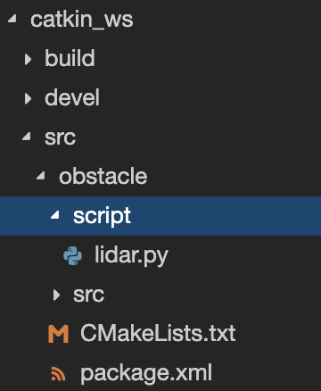

# Intelligent-Robotics

## ROS

### !. STEP

1. Create account: https://app.theconstructsim.com/

2. Create a New Rosject

   a. ROS Distro - ROS Kinect

   b. Name project

   c. Short description

3. Run Rosject

### 2. STEP

Let’s start creating our package, inside of **simulation_ws/src**:

1. Open shell (left-botton-corner)

   ```shell
   user:~$ cd ~/simulation_ws/src
   user:~$ catkin_create_pkg description urdf
   ```

2. Create a new folder **urdf** inside of **~/simulation_ws/src/description** and file: **~/simulation_ws/src/description/urdf/robot.xacro** 

This XML add to **robot.xacro**

```xml
<?xml version="1.0" ?>
<robot name="m2wr" xmlns:xacro="http://www.ros.org/wiki/xacro">
  <material name="black">
    <color rgba="0.0 0.0 0.0 1.0"/>
  </material>
  <material name="blue">
    <color rgba="0.203125 0.23828125 0.28515625 1.0"/>
  </material>
  <material name="green">
    <color rgba="0.0 0.8 0.0 1.0"/>
  </material>
  <material name="grey">
    <color rgba="0.2 0.2 0.2 1.0"/>
  </material>
  <material name="orange">
    <color rgba="1.0 0.423529411765 0.0392156862745 1.0"/>
  </material>
  <material name="brown">
    <color rgba="0.870588235294 0.811764705882 0.764705882353 1.0"/>
  </material>
  <material name="red">
    <color rgba="0.80078125 0.12890625 0.1328125 1.0"/>
  </material>
  <material name="white">
    <color rgba="1.0 1.0 1.0 1.0"/>
  </material>
  
  <gazebo reference="link_chassis">
    <material>Gazebo/Orange</material>
  </gazebo>
  <gazebo reference="link_left_wheel">
    <material>Gazebo/Blue</material>
  </gazebo>
  <gazebo reference="link_right_wheel">
    <material>Gazebo/Blue</material>
  </gazebo>
  
  <gazebo>
    <plugin filename="libgazebo_ros_diff_drive.so" name="differential_drive_controller">
      <legacyMode>false</legacyMode>
      <alwaysOn>true</alwaysOn>
      <updateRate>20</updateRate>
      <leftJoint>joint_left_wheel</leftJoint>
      <rightJoint>joint_right_wheel</rightJoint>
      <wheelSeparation>0.2</wheelSeparation>
      <wheelDiameter>0.2</wheelDiameter>
      <torque>0.1</torque>
      <commandTopic>cmd_vel</commandTopic>
      <odometryTopic>odom</odometryTopic>
      <odometryFrame>odom</odometryFrame>
      <robotBaseFrame>link_chassis</robotBaseFrame>
    </plugin>
  </gazebo>
  
  <link name="link_chassis">
    <!-- pose and inertial -->
    <pose>0 0 0.1 0 0 0</pose>
    <inertial>
      <mass value="5"/>
      <origin rpy="0 0 0" xyz="0 0 0.1"/>
      <inertia ixx="0.0395416666667" ixy="0" ixz="0" iyy="0.106208333333" iyz="0" izz="0.106208333333"/>
    </inertial>
    <!-- body -->
    <collision name="collision_chassis">
      <geometry>
        <box size="0.5 0.3 0.07"/>
      </geometry>
    </collision>
    <visual>
      <origin rpy="0 0 0" xyz="0 0 0"/>
      <geometry>
        <box size="0.5 0.3 0.07"/>
      </geometry>
      <material name="blue"/>
    </visual>
    <!-- caster front -->
    <collision name="caster_front_collision">
      <origin rpy=" 0 0 0" xyz="0.35 0 -0.05"/>
      <geometry>
        <sphere radius="0.05"/>
      </geometry>
      <surface>
        <friction>
          <ode>
            <mu>0</mu>
            <mu2>0</mu2>
            <slip1>1.0</slip1>
            <slip2>1.0</slip2>
          </ode>
        </friction>
      </surface>
    </collision>
    <visual name="caster_front_visual">
      <origin rpy=" 0 0 0" xyz="0.2 0 -0.05"/>
      <geometry>
        <sphere radius="0.05"/>
      </geometry>
    </visual>
  </link>
  
  <link name="link_right_wheel">
    <inertial>
      <mass value="0.2"/>
      <origin rpy="0 1.5707 1.5707" xyz="0 0 0"/>
      <inertia ixx="0.000526666666667" ixy="0" ixz="0" iyy="0.000526666666667" iyz="0" izz="0.001"/>
    </inertial>
    <collision name="link_right_wheel_collision">
      <origin rpy="0 1.5707 1.5707" xyz="0 0 0"/>
      <geometry>
        <cylinder length="0.04" radius="0.1"/>
      </geometry>
    </collision>
    <visual name="link_right_wheel_visual">
      <origin rpy="0 1.5707 1.5707" xyz="0 0 0"/>
      <geometry>
        <cylinder length="0.04" radius="0.1"/>
      </geometry>
    </visual>
  </link>
  
  <joint name="joint_right_wheel" type="continuous">
    <origin rpy="0 0 0" xyz="-0.05 0.15 0"/>
    <child link="link_right_wheel"/>
    <parent link="link_chassis"/>
    <axis rpy="0 0 0" xyz="0 1 0"/>
    <limit effort="10000" velocity="1000"/>
    <joint_properties damping="1.0" friction="1.0"/>
  </joint>
  
  <link name="link_left_wheel">
    <inertial>
      <mass value="0.2"/>
      <origin rpy="0 1.5707 1.5707" xyz="0 0 0"/>
      <inertia ixx="0.000526666666667" ixy="0" ixz="0" iyy="0.000526666666667" iyz="0" izz="0.001"/>
    </inertial>
    <collision name="link_left_wheel_collision">
      <origin rpy="0 1.5707 1.5707" xyz="0 0 0"/>
      <geometry>
        <cylinder length="0.04" radius="0.1"/>
      </geometry>
    </collision>
    <visual name="link_left_wheel_visual">
      <origin rpy="0 1.5707 1.5707" xyz="0 0 0"/>
      <geometry>
        <cylinder length="0.04" radius="0.1"/>
      </geometry>
    </visual>
  </link>
  
  <joint name="joint_left_wheel" type="continuous">
    <origin rpy="0 0 0" xyz="-0.05 -0.15 0"/>
    <child link="link_left_wheel"/>
    <parent link="link_chassis"/>
    <axis rpy="0 0 0" xyz="0 1 0"/>
    <limit effort="10000" velocity="1000"/>
    <joint_properties damping="1.0" friction="1.0"/>
  </joint>
</robot>
```

[

Basically, it’s a robot composed by 3 links and 2 joints. Every robot needs a base link, in this case, the **chassis** is in charge of connecting all the parts of the robot. See below an image that represents the relation between the links and joints. (Links in green, joints in blue)

### 4. STEP

We have our robot model defined. Let’s check it in RViz. In order to do that, let’s create a **launch** file and that opens **RViz** and fill its robot visualization with our fresh new model.

Create a new folder: **~/simulation_ws/src/description/launch/rviz.launch**

This XML add to **rviz.launch**

```xml
<?xml version="1.0"?>
<launch>

  <param name="robot_description" command="cat '$(find description)/urdf/robot.xacro'"/>

  <!-- send fake joint values -->
  <node name="joint_state_publisher" pkg="joint_state_publisher" type="joint_state_publisher">
    <param name="use_gui" value="False"/>
  </node>

  <!-- Combine joint values -->
  <node name="robot_state_publisher" pkg="robot_state_publisher" type="state_publisher"/>

  <!-- Show in Rviz   -->
  <node name="rviz" pkg="rviz" type="rviz" />

</launch>
```

### 5. STEP

```shell
user:~$ cd ~/simulation_ws
user:~/simulation_ws/$ catkin_make
user:~/simulation_ws/$ roslaunch description rviz.launch
```

You can open **Graphics tool** and you see **RVIz** world. Now we have to add our robot into world. In RVIz click:

Add --> moveit_ros_visualization --> RobotState --> OK

### 6. STEP

Robot in Gazebo.  First, create a new launch file: **~/simulation_ws/src/description/launch/spawn.launch** and add this XML

```xml
<?xml version="1.0" encoding="UTF-8"?>
<launch>
  
  <param name="robot_description" command="cat '$(find description)/urdf/robot.xacro'"/>

  <arg name="x" default="0"/>
  <arg name="y" default="0"/>
  <arg name="z" default="0.5"/>

  <node name="mybot_spawn" pkg="gazebo_ros" type="spawn_model" output="screen" args="-urdf -param robot_description -model m2wr -x $(arg x) -y $(arg y) -z $(arg z)" />
</launch>
```


Select a simulation --> choose robot (for example Turtlebot) --> choose Empty world --> Launch

Add our robot to Gazebo - shell command:

```shell
user:~/simulation_ws$ roslaunch description spawn.launch
user:~/simulation_ws$ rosrun teleop_twist_keyboard teleop_twist_keyboard.py 
```

### 7. STEP

Add LASER sensor to our robot. Copy this XML to **robot.xacro** file.

```xml
<!-- laser sensor -->
<joint name="joint_sensor_laser" type="fixed">
  <origin xyz="0.15 0 0.05" rpy="0 0 0"/>
  <parent link="link_chassis"/>
  <child link="sensor_laser"/>
 </joint>

 <link name="sensor_laser">
  <collision>
    <origin xyz="0 0 0" rpy="0 0 0"/>
    <geometry>
    <cylinder radius="0.05" length="0.1"/>
    </geometry>
  </collision>

  <visual>
    <origin xyz="0 0 0" rpy="0 0 0" />
    <geometry>
    <cylinder radius="0.05" length="0.1"/>
    </geometry>
    <material name="white" />
  </visual>


  <inertial>
   <mass value="1" />
   <origin xyz="0 0 0" rpy="0 0 0"/>
   <inertia ixx="1e-6" ixy="0" ixz="0" iyy="1e-6" iyz="0" izz="1e-6" />  
  </inertial>
 </link>

<gazebo reference="sensor_laser">
  <sensor type="ray" name="head_hokuyo_sensor">
   <pose>0 0 0 0 0 0</pose>
   <visualize>false</visualize>
   <update_rate>20</update_rate>
   <ray>
    <scan>
     <horizontal>
      <samples>720</samples>
      <resolution>1</resolution>
      <min_angle>-1.570796</min_angle>
      <max_angle>1.570796</max_angle>
     </horizontal>
    </scan>
    <range>
     <min>0.10</min>
     <max>10.0</max>
     <resolution>0.01</resolution>
    </range>
    <noise>
     <type>gaussian</type>
     <!-- Noise parameters based on published spec for Hokuyo laser
        achieving "+-30mm" accuracy at range < 10m. A mean of 0.0m and
        stddev of 0.01m will put 99.7% of samples within 0.03m of the true
        reading. -->
     <mean>0.0</mean>
     <stddev>0.01</stddev>
    </noise>
   </ray>
   <plugin name="gazebo_ros_head_hokuyo_controller" filename="libgazebo_ros_laser.so">
     <topicName>/mybot/laser/scan</topicName>
	   <frameName>sensor_laser</frameName>
   </plugin>
  </sensor>
 </gazebo>
```

Start gazebo and spawn our robot.

**Home work edit .xacro file and add some sensor.** 

### 8. STEP

Create new package ***obstacle*** in **~/catkin_ws/src** with package ***sensor_msgs, std_msgs, geometry_msgs, rospy***.

```shell
user:~$ cd ~/catkin_ws/src
user:~$ catkin_create_pkg obstacle sensor_msgs std_msgs geometry_msgs rospy
```

Check **~/catkin_ws/src/obstacle/CMakeLists.txt**, if you have define packages.

### 9. STEP

In folder **~/catkin_ws/src/obstacle/** create folder **script**. In folder **script** create file **lidar.py**. 



### 10. STEP

// create code lidar.py //

### 11. STEP

Run **lidar.py**

```shell
user:~/catkin_ws/src/obstacle/script$ rosrun obstacle lidar.py
```

If you cannot run lidar.py, you need to set permissions for this file.

```shell
user:~/catkin_ws/src/obstacle$ chmod +x obstacle/script/lidar.py
```

### 12. STEP

Values from lidar:

```
[INFO] [1635938659.785731, 183.912000]: [5.026895046234131, 10, 1.8938313722610474]
[INFO] [1635938659.827212, 183.959000]: [5.030259132385254, 10, 1.8882664442062378]
[INFO] [1635938659.897430, 184.009000]: [5.0252838134765625, 10, 1.901473045349121]
```
### 13. STEP

// create code move.py

### 14. STEP

// create code "turn around" when obstacle is before robot //
